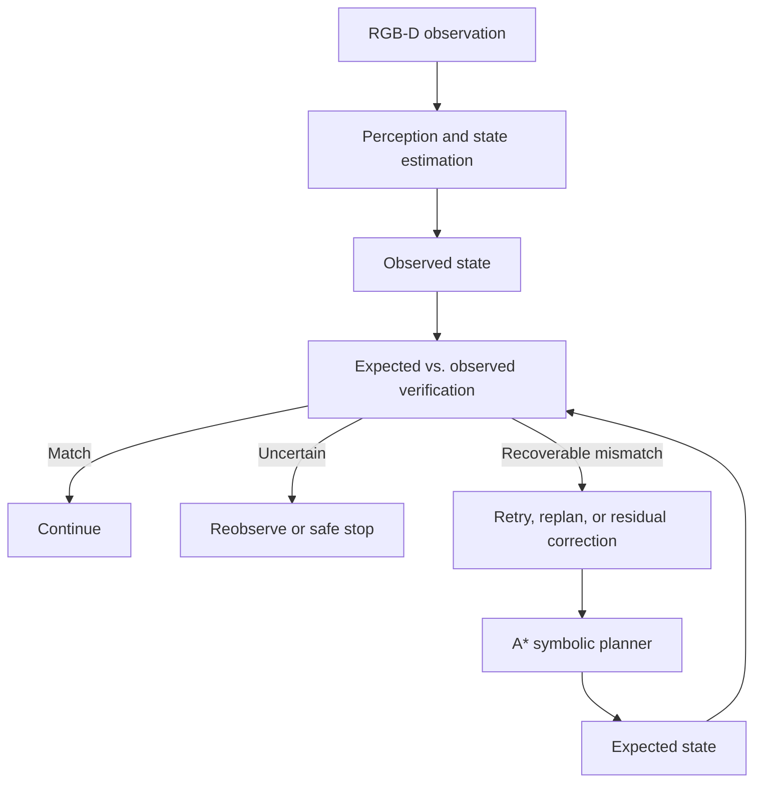

# Hanoi-RX

GPU-accelerated robot manipulation using visual verification, symbolic planning, and learned recovery, evaluated through a sim-to-real Tower of Hanoi benchmark.

> **Status:** Research in progress. The architecture, experimental protocol, and success criteria are defined; implementation and evaluation results will be added as each stage is qualified.

## Overview

Hanoi-RX investigates how closed-loop visual verification and bounded recovery affect the reliability of long-horizon robot manipulation. The three-disk Tower of Hanoi provides a controlled testbed: the symbolic problem is simple and fully specified, but physical completion requires seven dependent pick-and-place actions. A small grasp, calibration, or placement error can change the state inherited by every later action.

The system combines RGB-D perception, A* task planning, collision-aware motion control, post-action verification, deterministic recovery, and a learned residual alignment policy. The learned component is deliberately limited to small local corrections; it does not control task legality or generate unconstrained robot trajectories.

## Research question

> Does closed-loop visual verification combined with bounded learned recovery improve long-horizon manipulation reliability under calibration error, object displacement, and grasp or placement uncertainty?

The primary hypothesis is that verification plus residual recovery will improve complete seven-move puzzle success by at least **25 percentage points** over the same manipulation stack operated open-loop, while producing **zero illegal symbolic moves** and **zero collisions** in the final evaluation.

## Why Tower of Hanoi?

Tower of Hanoi separates planning correctness from physical reliability:

- The legal symbolic state and optimal move sequence are known.
- A three-disk puzzle requires seven dependent actions.
- Perception, grasping, motion, placement, and recovery can be evaluated independently.
- Controlled disturbances can be introduced without changing the underlying task.
- Complete-task success exposes how small action-level errors compound over time.

## System architecture

The controller stores expected state, observed state, and confidence separately. After every placement, it chooses one auditable action:

`CONTINUE` | `REOBSERVE` | `RETRY` | `RESIDUAL_CORRECT` | `REPLAN` | `SAFE_STOP`

## Core components

### Symmetry-aware perception

The operational disk state uses center position, radius or identity, peg assignment, stack height, tilt, and confidence. Rotation around a disk's central axis is intentionally excluded because it is both unobservable and irrelevant to the task.

The primary baseline uses RGB-D geometry. FoundationPose is treated as an accelerated comparison rather than a critical dependency, and an AprilTag board frame provides registration and calibration diagnostics.

### Symbolic planning and motion

An A* planner searches legal Hanoi states and emits source-peg and destination-peg actions. A grasp generator converts each symbolic move into pre-grasp, approach, grasp, lift, transfer, place, release, and retreat phases.

MoveIt 2 provides the required collision-aware motion baseline. NVIDIA cuMotion may be evaluated as a measured alternative.

### Learned residual alignment

The learned policy corrects only the final centimeters of grasp or peg placement. It receives a local RGB-D crop, nominal target transform, recent controller error, and confidence, then returns a clipped Cartesian correction and an abstention score.

Training uses GPU-parallel Isaac Lab environments with randomized board pose, camera extrinsics, depth noise, friction, disk offset, and gripper alignment.

### Verification and recovery

Every commanded placement is followed by a fresh observation. The verifier compares expected and observed state, classifies disagreement, and selects a bounded recovery response. Low confidence, repeated disagreement, controller faults, or workspace violations result in a safe stop rather than an improvised action.

## Experimental design

### Systems under comparison

| ID | System | Research purpose |
| --- | --- | --- |
| **S0** | Open-loop classical | Measure reliability when commanded success is assumed. |
| **S1** | Visual verification only | Isolate the value of detecting divergence without autonomous correction. |
| **S2** | Verification and rule recovery | Evaluate deterministic reobserve, retry, and replan strategies. |
| **S3** | Verification and residual policy | Test whether bounded learned correction improves recovery under alignment error. |

### Evaluation conditions

| ID | Condition | Purpose |
| --- | --- | --- |
| **E0** | Nominal randomized starts | Establish unperturbed task reliability. |
| **E1** | Board-frame calibration offset | Measure calibration robustness. |
| **E2** | Disk displacement after planning | Test divergence detection and replanning. |
| **E3** | Partial occlusion or low-confidence depth | Test abstention and reobservation behavior. |
| **E4** | Controlled grasp or placement misalignment | Isolate the residual policy's intended contribution. |

The planned protocol includes at least 1,000 simulation episodes per system-condition cell across held-out seeds, followed by a physical pilot and at least 30 full-puzzle trials per principal condition. System order, disturbance ranges, thresholds, and exclusion criteria will be frozen before the final battery.

## Success criteria

- S3 improves complete-task success by at least 25 percentage points over S0 under the preregistered disturbance mixture.
- Zero illegal symbolic moves and zero collisions occur in the final battery.
- Failure detection reaches at least 90% precision and recall for predefined classes.
- Verification and recovery latency are reported at p50 and p95 on the target compute platform.
- S3 outperforms rule recovery on the E4 alignment condition without increasing false corrections or unsafe stops.
- Sim-to-real degradation is reported for every system rather than collapsed into one aggregate result.

A negative learning result remains valuable if the benchmark, failure analysis, and reproducibility evidence are strong. The minimum viable research result is the S0-S2 closed-loop system with physical trials and credible CPU/GPU profiling.

## Reference implementation

The initial configuration is a compatibility baseline, not a purchase requirement. Exact hardware and software versions will be qualified before the final implementation is frozen.

| Layer | Reference baseline |
| --- | --- |
| Robot | UFACTORY xArm 6 with parallel gripper |
| Camera | Intel RealSense D435i |
| Edge inference | NVIDIA Jetson Orin NX 16GB |
| Simulation host | Ubuntu x86_64 with RTX 4080 16GB or better |
| Simulation | NVIDIA Isaac Sim 6.x and compatible Isaac Lab |
| Robot software | Ubuntu 22.04, ROS 2 Humble, and `xarm_ros2` |
| Motion planning | MoveIt 2 baseline with an optional cuMotion comparison |
| Reproducibility | Containers, lockfiles, pinned drivers, model hashes, and run manifests |

## Safety boundaries

- The symbolic planner alone determines legal disk moves.
- MoveIt 2 or cuMotion owns gross collision-free motion.
- The residual policy is restricted to a small Cartesian correction envelope.
- Low confidence and repeated disagreement trigger reobservation or safe stop.
- Physical trials require an E-stop, fixed base, guarded workspace, and conservative speed limits.
- Every state transition and recovery decision is logged with its inputs, confidence, latency, and outcome.

## Reproducibility and observability

Each run is designed to retain:

- Raw and annotated RGB-D observations
- Expected, observed, and reconciled state
- Planned moves, trajectories, and controller outcomes
- Failure classifications, recovery decisions, and abstention reasons
- Component and end-to-end latency
- CPU/GPU utilization, memory, power mode, and thermal state
- Random seed, software digest, model hash, hardware configuration, and operator notes

## Roadmap

1. **Compatibility and smoke testing** - qualify the arm, gripper, camera, simulator, ROS 2 stack, and edge target.
2. **Classical closed loop** - implement legal-state planning, motion generation, perception, and deterministic recovery.
3. **Residual policy** - train and validate the bounded correction policy in randomized simulation.
4. **Physical evaluation** - run the frozen disturbance protocol and retain every failure.
5. **Ablation and reporting** - compare S0-S3, quantify the sim-to-real gap, and publish the technical report, dataset, and demonstration.

## Planned outputs

- Containerized simulation and robot setup
- ROS 2 perception, planning, verification, and recovery components
- Isaac Lab residual-policy training environments
- Frozen evaluation manifests and controlled disturbance fixtures
- Structured run logs and labeled failure dataset
- Statistical analysis, latency profiles, and sim-to-real results
- Technical report and demonstration video

## Repository topics

`robotics` `robot-manipulation` `computer-vision` `sim-to-real` `isaac-sim` `isaac-lab` `ros2` `nvidia-jetson` `rgb-d` `motion-planning` `residual-learning` `closed-loop-control` `tower-of-hanoi`

